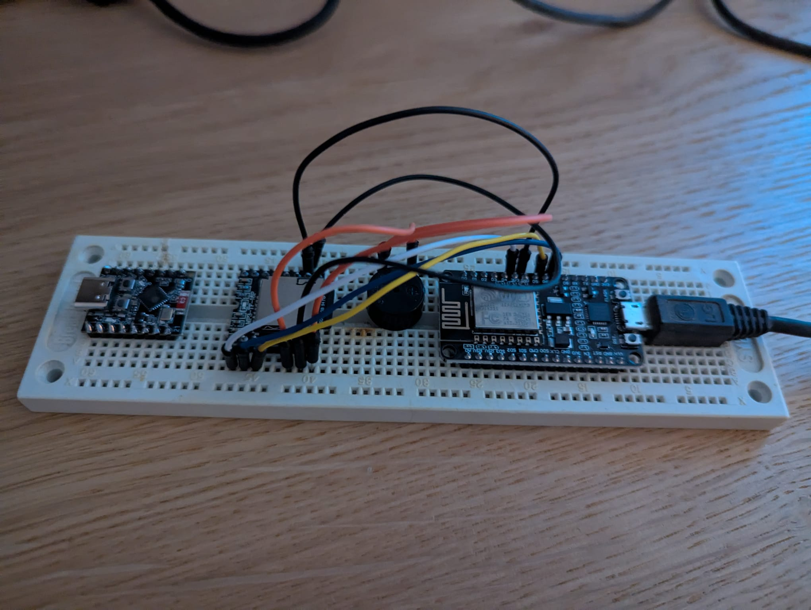
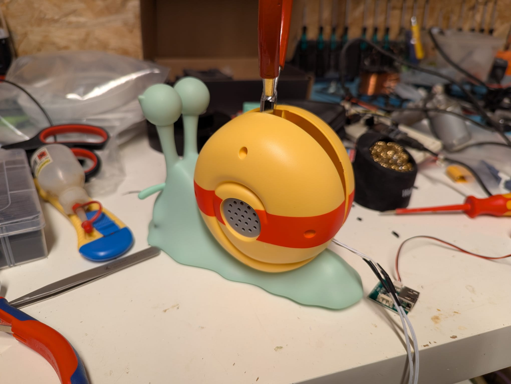
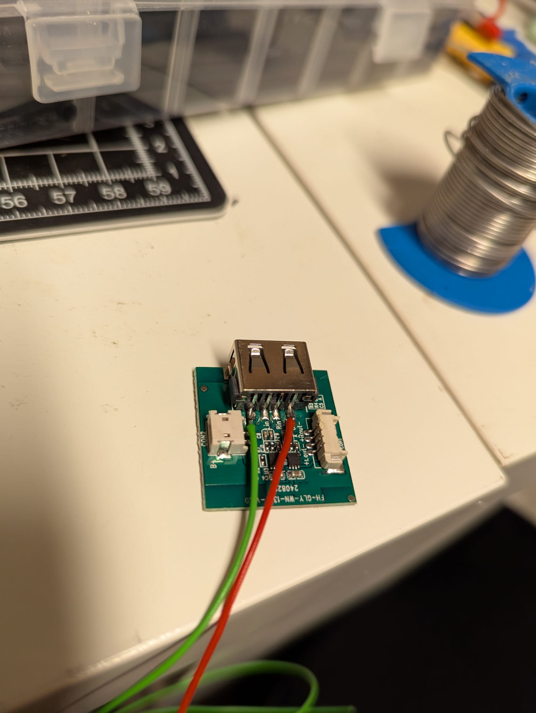
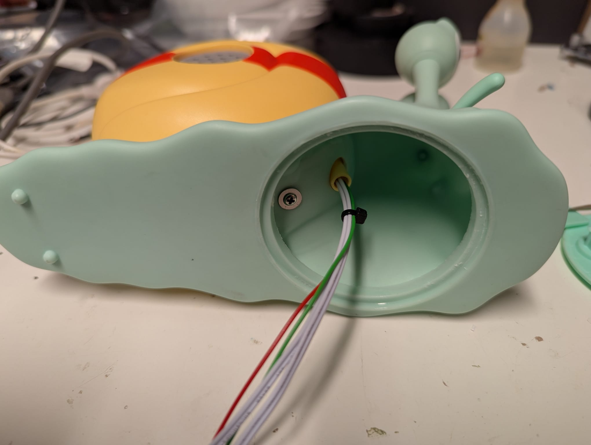
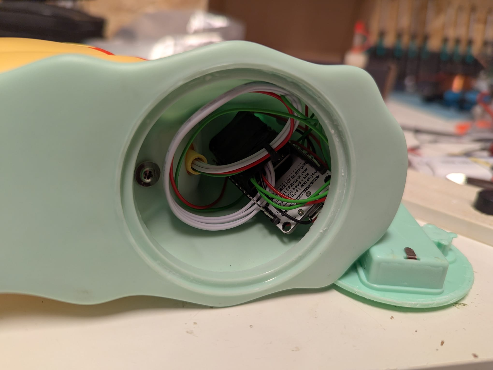

# DenDenMushiBell

DenDenMushiBell is a SIP client running on an ESP8266 microcontroller designed to work with a Fritzbox VoIP system for doorbell notification. When the doorbell rings, the Fritzbox calls all registered phones, including the ESP8266 SIP client. Upon receiving the call, the ESP8266 plays a mp3 ringtone (ofcourse the DenDenMushi one) via a DFPlayer Mini audio module and then hangs up automatically.

## Features
- ESP8266-based SIP client integration with Fritzbox
- Automatic registration and subscription to SIP service
- Plays ringtone on incoming call using DFPlayer Mini
- WiFi connectivity setup via WiFiManager for easy configuration
- Auto hang-up after ringtone playback
- Lightweight and reliable operation on ESP8266

## How It Works
The ESP8266 connects to the local WiFi network configured via a web-based portal (WiFiManager). It then registers as a SIP client with the Fritzbox using configured SIP credentials, listening on the SIP port for incoming calls triggered by the doorbell press. When an incoming call is detected, the ESP8266 plays the DenDenMushi ringtone stored on the DFPlayer Mini and hangs up afterward.

## Technical Details

- **Microcontroller:** ESP8266  
- **Audio Module:** DFRobot DFPlayer Mini connected via SoftwareSerial (pins 12 & 13)  
- **SIP Library:** ArduinoSIP for handling SIP registration and calls  
- **WiFi Setup:** WiFiManager creates an access point named `"DenDenMushi"` for easy WiFi credential input  
- **SIP Server:** Fritzbox local IP (`192.168.178.1`) on port 5060  

## Requirements

- ESP8266 board (NodeMCU, Wemos D1, etc.)  
- DFRobot DFPlayer Mini MP3 player module  
- Fritzbox router with SIP enabled and SIP user credentials configured  
- Small speaker or compatible audio output connected to DFPlayer Mini  
- Micro USB power supply for ESP8266  
- DenDenMushi :D

## Hardware
The hardware of my setup was based on a NodeMCUv3, a DFplayer mini and a piezo buzzer. The ESP8266 is controlling the DFplayer mini via software serial. The pins for software serial can be adapted in the code via define.

## Modification of original DenDenMushi speaker
The original DenDenMushi features two small speakers and a very compact amplifier board. The amplifier board is powered via two batteries, residing in the base of the snail, the audio signal is provided by an USB-A socket on the back. However, this USB socket is misused here as an audio signal line-in! A special USB to 3.5mm jack cable is included specifically for this purpose. If a normal USB power supply were connected, it would damage the amplifier.

Unfortunately, the case is glued firmly to the base, making it difficult to open. It can be pried open gently with pliers to work inside. Surgeons might have an advantage here :D

This allows the amplifier board to be removed, and wires can be soldered directly to the USB socket, to power the whole thing via USB directly instead of relying on the batteries. The speaker cables can also be extended. All cables can then be routed through a gland to the front into the snail's head. The head is relatively easy to access by removing the battery compartment, which is glued to the base with just two adhesive points.

In the hollow space inside the head, both the DFPlayer and the ESP8266 board can be housed.

